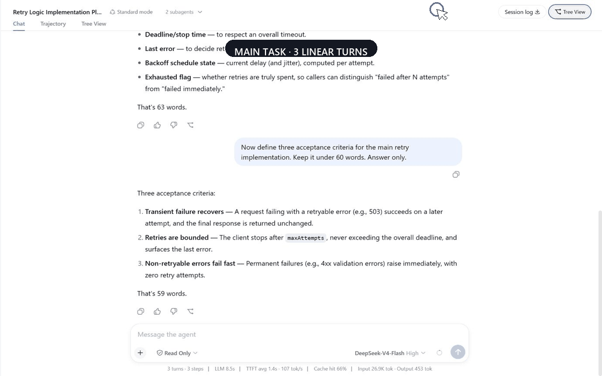
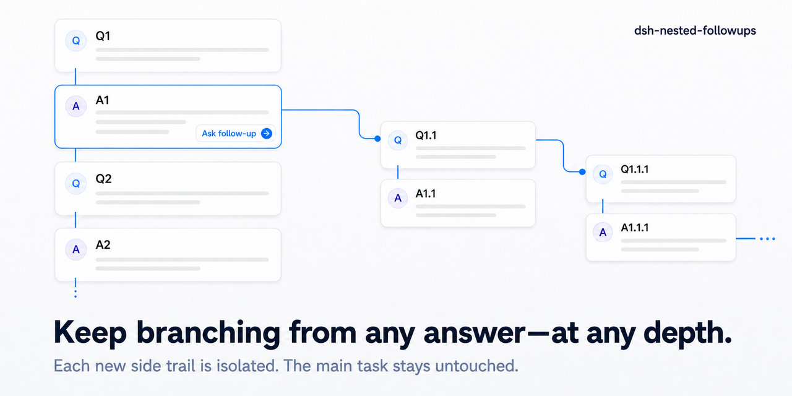

# dsh-nested-followups

English | [中文](README.zh.md)

**Branch from any answer. Keep branching at any depth.**

A [DeepSeek Harness](https://github.com/deepseek-ai/deepseek-harness) plugin
for isolated follow-ups that can keep branching recursively, with no
plugin-defined depth limit. Start a side trail from any answer, then turn any
answer anywhere in that trail into the next isolated fork point. Repeat for as
many levels as the question needs. Every level inherits only its ancestor path,
while the main task stays linear and untouched.

[](https://www.npmjs.com/package/dsh-nested-followups)
[](tests)
[](https://github.com/deepseek-ai/deepseek-harness)
[](LICENSE)



_Recorded in an unmodified DeepSeek Harness `0.1.1-rc.2` web profile. The UI
and sessions are real; the captions and cursor are added in post._

> **MAIN TASK → SIDE QUESTION → NESTED SIDE QUESTION → NEST AGAIN → …**

- **Start a side trail anywhere.** The first branch receives exactly the history
  that existed at the selected answer.
- **Keep branching at any depth.** Every answer in every side trail can become
  another isolated fork point. Apply the same action again at every new level.
- **Keep the main task clean.** Nothing asked or answered in a branch flows back
  into the main conversation.

## Install

```sh
dsh plugin --profile web add dsh-nested-followups
```

Restart the DeepSeek Harness web profile if it is already running, open a
conversation, and select **Tree View**.

<details>
<summary>Install from source</summary>

```sh
git clone https://github.com/sluminositys/dsh-nested-followups.git
cd dsh-nested-followups
pnpm install
pnpm run check
dsh plugin --profile web add .
```

</details>

## Why not a new chat or a sidebar thread?

| Approach | Relevant earlier context | Main stays clean | Can keep branching at later depths | Trail stays attached |
| --- | --- | --- | --- | --- |
| Ask in the main chat | Yes | No | No | Not applicable |
| Open a new conversation | Lost or copied manually | Yes | No | No |
| Typical temporary sidebar Q&A | Varies | Usually | Usually a linear side thread | Usually not |
| **dsh-nested-followups** | **Exact ancestor path** | **Yes** | **Yes—recursively, with no fixed depth** | **Yes** |

The distinguishing feature is not the canvas. It is that any answer at any
depth can become another isolated fork point, and the same rule keeps applying
to every descendant. The tree is only the map that keeps those recursive
detours visible and attached to the root session.



_The diagram draws two nested levels and then an ellipsis: the same fork action
remains available on every answer at every later depth._

## Use it

1. Chat normally. The standard DSH chat, sidebar, composer, and message
   rendering remain unchanged.
2. Select **Tree View**, choose an earlier completed assistant answer, and
   select **Ask follow-up**. The question grows to the right in a new branch.
3. On the latest answer in a branch, use **Continue this branch** to add the
   next turn downward. Use **Ask follow-up** to create another isolated branch
   to the right. Repeat **Ask follow-up** on any descendant answer to keep
   nesting as deeply as needed.
4. Return to **Chat** whenever you want to continue the main task. Its history
   contains no branch messages.

| Action | Direction | Session effect |
| --- | --- | --- |
| **Ask follow-up** | Right | Creates a new isolated child session at the selected answer |
| **Continue this branch** | Down | Adds the next exchange to the current branch session |

**Continue this branch** appears only on the latest completed answer in a
branch. Main-line nodes never offer it, so the two operations cannot be
confused.

## Why every level is a real branch

This is not a prompt that asks the model to pretend later messages do not
exist, and it is not a line drawn between unrelated chats.

- Every branch, including a branch created inside another branch, is a real
  DeepSeek Harness session with durable history.
- The same fork rule applies recursively at every level; the plugin does not
  impose a nesting-depth limit.
- Its seed is the exact ancestor path through the selected completed answer,
  using the same event-boundary semantics as DSH's session fork path.
- Later messages from the main task, parent side trail, and sibling branches are
  absent unless they are ancestors of the new branch point.
- Messages never flow upward to a parent session or sideways to a sibling.
- Branch tools are enforced read-only when they execute, protecting the shared
  workspace from side-question activity.
- The request prefix remains byte-for-byte compatible with the parent at the
  fork point, so the model provider can reuse its prefix cache.

## What Tree View includes

- One card per user message and assistant answer, with the main conversation
  running downward and isolated branches growing to the right.
- Unlimited nested follow-ups and linear continuation within each branch.
- Search that reveals collapsed ancestors before centering a match.
- Focus mode, pan, zoom, fit-to-view, and a minimap for large trees.
- Progressive dot → capsule → card expansion, plus one-action collapse.
- Cascading branch deletion with an exact branch and message count.
- Durable branch metadata and per-conversation view state across restarts.
- No branch entries in the normal sidebar session list.

### Progressive collapse

A tree opens fully folded on first visit: the main conversation plus one dot
per answer that has branches. Select **⊕** to reveal one capsule per branch,
then select a capsule to restore that branch's cards. Child anchors stay folded
until you open them, so one expansion never floods the canvas with every
descendant.

Alt-select **⊕** or a capsule to expand all descendants. **Collapse all**
returns top-level groups to dots. A pulsing blue marker means a folded
descendant is generating; red means one failed. The layout is restored per
conversation after a restart.

### Read-only branch execution

Branches share the main conversation's working directory, so allowing a side
question to write would be unsafe. The plugin therefore checks tools when they
actually run. Read operations are permitted; writes and unknown tools are
refused by default.

Allowed tools are `read`, `read_image`, `glob`, `grep`, `lsp`, the `session_*`
query tools, `job_list`, `job_output`, `terminal_list`, `terminal_read`,
`list_agents`, and `get_goal`. Code Mode's `run_code` remains available because
every tool it invokes is checked individually.

### Provider prefix-cache reuse

A branch joins the same preset as its parent and does not rewrite tool
definitions, prompt sections, or presentation format. Its request therefore
starts with the same bytes as the parent request at the branch point. Providers
that cache request prefixes can reuse that context instead of reading the
inherited conversation again.

## Requirements

| Requirement | Version |
| --- | --- |
| DeepSeek Harness | `0.1.x` (verified on `0.1.0-rc.7`, `0.1.0-rc.8`, and `0.1.1-rc.2`) |
| Node.js | 22.19 or later |
| Package manager | pnpm |

## Compatibility notes

This release is verified against an unmodified `@deepseek-ai/dsh`
`0.1.1-rc.2` and keeps `0.1.0-rc.7` as its compatibility floor. DeepSeek
Harness is still in developer preview, so later prereleases may require an
adapter update.

**Branches cannot be continued from the standard chat view.** DSH currently
rejects user messages sent from the normal chat UI to a subagent-origin
session. Reading and continuing a branch therefore happen in Tree View. The
plugin probes for a future host capability that could safely restore native
continuation, but enables it only when DSH explicitly guarantees message
delivery.

**Branches may appear in the built-in Subagent menu as disabled diagnostic
rows.** They cannot be selected, are skipped by keyboard navigation, and do not
count as active child agents. This does not affect the root conversation or the
sidebar, where branch sessions remain hidden.

## Uninstall

```sh
dsh plugin --profile web remove dsh-nested-followups
```

Uninstalling removes the plugin UI and services. It does not modify the main
conversation or delete persisted branch history.

## Development

```sh
pnpm install
pnpm run check
```

`pnpm run check` runs linting, host and browser type checking, 156 unit and
integration tests, a production build, a smoke test, and package validation.

| Command | Purpose |
| --- | --- |
| `pnpm run lint` | Static analysis |
| `pnpm run typecheck` | Host, browser, and test type checking |
| `pnpm test` | Unit and integration tests |
| `pnpm run build` | Production build |
| `pnpm run check` | Complete release gate |

## Contributing

Issues and pull requests are welcome. See [CONTRIBUTING.md](CONTRIBUTING.md)
and run `pnpm run check` before submitting a pull request.

## License

[MIT](LICENSE)
